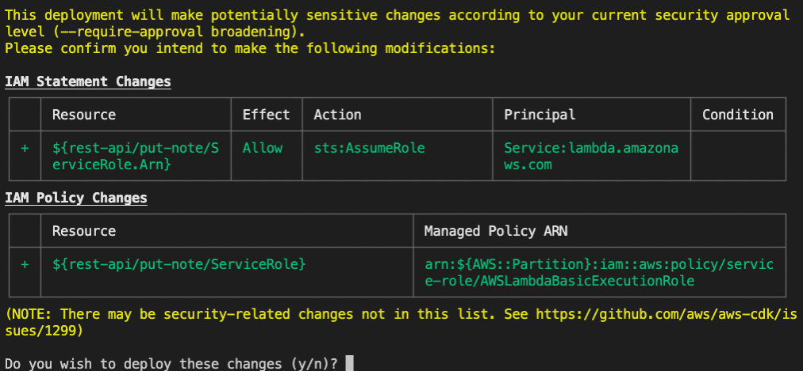

# Adding Notes

## In this lab …

- Setting up a basic RESTful HTTP API with Amazon API Gateway, Lambda, and DynamoDB, so you are able to add notes.

## AWS Lambda function

### 📝 Task

Now that we have our app hosted via AWS Cloudfront and Amazon S3, create a simple AWS Lambda function, that logs the message `Hello world :)`.

### 🔎 Hints

- [CDK Construct to create a Node.js Lambda function](https://docs.aws.amazon.com/cdk/api/v2/docs/aws-cdk-lib.aws_lambda_nodejs-readme.html#nodejs-function)
- [Simple Lambda function with log output](https://docs.aws.amazon.com/lambda/latest/dg/nodejs-logging.html)
- [Hint about local bundling (to avoid Docker)](https://docs.aws.amazon.com/cdk/api/v2/docs/aws-cdk-lib.aws_lambda_nodejs-readme.html#local-bundling)
- [Adding CDK dependencies with Projen](https://github.com/projen/projen/blob/main/docs/api/API.md#class-awscdktypescriptapp--)

### 🗺 Step-by-Step Guide

1. Create a new file for the AWS Lambda function:
   ```bash
   touch ./src/http-api.put-note.ts
   ```
1. Add the following code to the file:
   ```typescript
   export const handler = async () => {
     console.log("Hello World :)");
   };
   ```
1. Update the `.projenrc.js` configuration:

   ```js
   const { awscdk, javascript } = require("projen");
   const project = new awscdk.AwsCdkTypeScriptApp({
     cdkVersion: "2.1.0",
     defaultReleaseBranch: "main",
     github: false,
     name: "notes-api",
     packageManager: javascript.NodePackageManager.NPM,
     deps: [
       "@aws-sdk/client-dynamodb",
       "@aws-sdk/lib-dynamodb",
       "aws-sdk",
       "fs-extra",
     ],
     devDeps: ["@types/fs-extra", "@types/aws-lambda"],
   });

   project.synth();
   ```

1. Run `npm run projen` to install the new dependencies and re-generate the auto-generated files.
1. Create a new file for the new construct:
   ```bash
   touch ./src/http-api.ts
   ```
1. Add the following code to the file:

   ```typescript
   import { NodejsFunction } from "aws-cdk-lib/aws-lambda-nodejs";
   import { Construct } from "constructs";

   export class HttpApi extends Construct {
     constructor(scope: Construct, id: string) {
       super(scope, id);

       new NodejsFunction(this, "put-note");
     }
   }
   ```

1. Update the file `./src/main.ts`:

   ⚠️Important: Only update the imports and the class. Everything below the class should be the same.

   ```typescript
   import { App, Stack, StackProps } from "aws-cdk-lib";
   import { Construct } from "constructs";
   import { HttpApi } from "./http-api";

   export class MyStack extends Stack {
     constructor(scope: Construct, id: string, props: StackProps = {}) {
       super(scope, id, props);

       new StaticHosting(this, "static-hosting");

       new HttpApi(this, "http-api");
     }
   }
   ```

1. Deploy the latest changes: `npm run deploy`
   %TODO: Double check - this quite likely will already come earlier in Lab 1 - we might skip this completely or have a new screenshot for Lab 1
   Be aware you will be asked to confirm IAM Statement and IAM Policy Changes:

   

## Amazon API Gateway

### 📝 Task

The AWS Lambda function is already a big step, but now we want to create a HTTP endpoint so we can execute the AWS Lambda function. We use Amazon API Gateway to create a simple API.

The API should be able to handle this curl request:

```bash
$ > curl -X POST https://XXXXX.execute-api.eu-central-1.amazonaws.com/notes
HTTP/2 200

{"hello":"world"}
```

### 🔎 Hints

- [CDK Construct to create an API Gateway with Lambda integration](https://docs.aws.amazon.com/cdk/api/v2/docs/aws-apigatewayv2-alpha-readme.html#defining-http-apis)
- [Lambda function response format for API Gateway integrations](https://docs.aws.amazon.com/apigateway/latest/developerguide/http-api-develop-integrations-lambda.html#http-api-develop-integrations-lambda.response)
- [CloudFormation stack output for the API endpoint](https://docs.aws.amazon.com/cdk/api/v2/docs/aws-cdk-lib-readme.html#stack-outputs)

### 🗺 Step-by-Step Guide

1. Update the file `./src/http-api.ts`:

   ```typescript
   import * as apigwv2 from "@aws-cdk/aws-apigatewayv2-alpha";
   import { HttpLambdaIntegration } from "@aws-cdk/aws-apigatewayv2-integrations-alpha";
   import { NodejsFunction } from "aws-cdk-lib/aws-lambda-nodejs";
   import { CfnOutput } from "aws-cdk-lib";
   import { Construct } from "constructs";

   export class HttpApi extends Construct {
     constructor(scope: Construct, id: string) {
       super(scope, id);

       const putNote = new NodejsFunction(this, "put-note");

       const api = new apigwv2.HttpApi(this, "api", {
         corsPreflight: {
           allowHeaders: ["Content-Type"],
           allowMethods: [
             apigwv2.CorsHttpMethod.GET,
             apigwv2.CorsHttpMethod.OPTIONS,
             apigwv2.CorsHttpMethod.POST,
           ],
           allowOrigins: ["*"],
         },
       });

       const putNotesIntegration = new HttpLambdaIntegration(
         "putNotesIntegration",
         putNote
       );

       api.addRoutes({
         path: "/notes",
         methods: [apigwv2.HttpMethod.POST],
         integration: putNotesIntegration,
       });

       new CfnOutput(this, "apiEndpoint", {
         value: api.url!,
       });
     }
   }
   ```

1. Update the AWS Lambda function (`./src/http-api.put-note.ts`):

   ```typescript
   export const handler = async () => {
     console.log("Hello World :)");

     return {
       statusCode: 200,
       body: JSON.stringify({ hello: "world" }),
     };
   };
   ```

1. Update the `.projenrc.js` configuration:

   ```js
   const { awscdk, javascript } = require("projen");
   const project = new awscdk.AwsCdkTypeScriptApp({
     cdkVersion: "2.1.0",
     defaultReleaseBranch: "main",
     github: false,
     name: "notes-api",
     packageManager: javascript.NodePackageManager.NPM,
     deps: [
       "@aws-sdk/client-dynamodb",
       "@aws-sdk/lib-dynamodb",
       "@aws-cdk/aws-apigatewayv2-alpha",
       "@aws-cdk/aws-apigatewayv2-integrations-alpha",
       "aws-sdk",
       "fs-extra",
     ],
     devDeps: ["@types/fs-extra", "@types/aws-lambda"],
   });

   project.synth();
   ```

1. Run `npm run projen` to install the new dependencies and re-generate the auto-generated files.

1. Deploy the latest changes:
   ```bash
   npm run deploy
   ```
1. Copy the endpoint URL from the output of the deployment in your terminal and run the following request to send a HTTP request:
   ```bash
   curl -X POST https://XXXXX.execute-api.eu-central-1.amazonaws.com/notes
   ```
   %TODO: Frontend-App: Let them do it or have it already in place?
1. You want to see if this also works in your hosted app? Check the frontend URL you received in Lab 1.

## AWS DynamoDB

### 📝 Task

We have an API in place, executing the AWS Lambda function to return a HTTP status code and some JSON. Great, now we want to create a DynamoDB table to persist some data.

The API should be able to handle this request:

```bash
$ > curl -X POST https://XXXXXXX.execute-api.eu-central-1.amazonaws.com/notes --data '{ "title": "Hello World", "content": "abc" }' -H 'Content-Type: application/json' -i
HTTP/2 201
```

The note should be persisted in the DynamoDB table.

### 🔎 Hints

- [CDK Construct to create a DynamoDB table](https://docs.aws.amazon.com/cdk/api/v2/docs/aws-cdk-lib.aws_dynamodb-readme.html)
- [Prop to pass the DynamoDB table name to the AWS Lambda function environment](https://docs.aws.amazon.com/cdk/api/v2/docs/aws-cdk-lib.aws_lambda_nodejs.NodejsFunction.html#environment)
- [Prop to grant access to the DynamoDB table, so the AWS Lambda function can send requests](https://docs.aws.amazon.com/cdk/api/v2/docs/aws-cdk-lib.aws_dynamodb.Table.html#grantgrantee-actions)
- [NPM package for AWS Lambda function event types (APIGatewayProxyEvent is your friend)](https://www.npmjs.com/package/@types/aws-lambda)
- [Documentation for the DynamoDBDocument (DynamoDBDocumentClient with convenience methods](https://docs.aws.amazon.com/AWSJavaScriptSDK/v3/latest/classes/_aws_sdk_lib_dynamodb.dynamodbdocument-1.html#put)

### 🗺 Step-by-Step Guide

1. Update the construct (`src/http-api.ts`):

   ```typescript
   import * as apigwv2 from "@aws-cdk/aws-apigatewayv2-alpha";
   import { HttpLambdaIntegration } from "@aws-cdk/aws-apigatewayv2-integrations-alpha";
   import { NodejsFunction } from "aws-cdk-lib/aws-lambda-nodejs";
   import { CfnOutput } from "aws-cdk-lib";
   import * as dynamodb from "aws-cdk-lib/aws-dynamodb";
   import { Construct } from "constructs";

   export class HttpApi extends Construct {
     public notesTable: dynamodb.Table;

     constructor(scope: Construct, id: string) {
       super(scope, id);

       this.notesTable = new dynamodb.Table(this, "notes-table", {
         partitionKey: { name: "id", type: dynamodb.AttributeType.STRING },
         stream: dynamodb.StreamViewType.NEW_IMAGE,
       });

       const putNote = new NodejsFunction(this, "put-note", {
         environment: {
           TABLE_NAME: this.notesTable.tableName,
         },
       });

       this.notesTable.grant(putNote, "dynamodb:PutItem");

       const api = new apigwv2.HttpApi(this, "api", {
         corsPreflight: {
           allowHeaders: ["Content-Type"],
           allowMethods: [
             apigwv2.CorsHttpMethod.GET,
             apigwv2.CorsHttpMethod.OPTIONS,
             apigwv2.CorsHttpMethod.POST,
           ],
           allowOrigins: ["*"],
         },
       });

       const putNotesIntegration = new HttpLambdaIntegration(
         "putNotesIntegration",
         putNote
       );

       api.addRoutes({
         path: "/notes",
         methods: [apigwv2.HttpMethod.POST],
         integration: putNotesIntegration,
       });

       new CfnOutput(this, "apiEndpoint", {
         value: api.url!,
       });
     }
   }
   ```

1. Update the AWS Lambda function (`src/http-api.put-note.ts`):

   ```typescript
   import { DynamoDBClient } from "@aws-sdk/client-dynamodb";
   import { DynamoDBDocument } from "@aws-sdk/lib-dynamodb";

   export const handler = async (event: AWSLambda.APIGatewayProxyEvent) => {
     const DB = DynamoDBDocument.from(new DynamoDBClient({}));

     const body = JSON.parse(event.body || "{}");

     if (!body.title || !body.content) {
       return {
         statusCode: 400,
       };
     }

     await DB.put({
       Item: {
         id: new Date().toISOString(),
         title: body.title,
         content: body.content,
       },
       TableName: process.env.TABLE_NAME!,
     });

     return {
       statusCode: 201,
     };
   };
   ```

1. Deploy the latest changes:
   ```bash
   npm run deploy
   ```
1. Send a HTTP request with your endpoint url:
   ```bash
   curl -X POST https://XXXXXX.execute-api.eu-central-1.amazonaws.com/notes --data '{ "title": "Hello World", "content": "abc" }' -H 'Content-Type: application/json' -i
   ```
1. Ideally, we have stored the first DynamoDB item! 🎉

%TODO: Update following implementation + link:
You can find the complete implementation of this lab [here](https://github.com/superluminar-io/fullstack-serverless-workshop/tree/main/packages/lab2).
