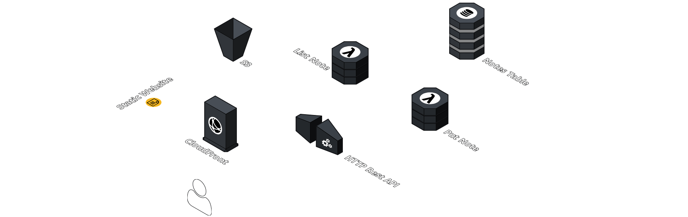

# Fetching Notes

## In this lab …

... Extend the API to be able to fetch and see your notes in your frontend app.



## Fetch list of notes

### 📝 Task

The first endpoint works! Let's extend the API and provide another route to fetch all notes. The API should be able to handle this request:

```bash
$ > curl https://XXXXXX.execute-api.eu-central-1.amazonaws.com/notes -i
HTTP/2 200

[{"content":"abc","id":"2021-04-27T11:54:47.987Z","title":"Hello World"}]
```

### 🔎 Hints

- [DocumentClient Scan operation](https://docs.aws.amazon.com/AWSJavaScriptSDK/v3/latest/classes/_aws_sdk_lib_dynamodb.dynamodbdocument-1.html#scan)

### 🗺 Step-by-Step Guide

1. Extend the construct (`./src/http-api.ts`):

   ```typescript
   import * as apigwv2 from "@aws-cdk/aws-apigatewayv2-alpha";
   import { HttpLambdaIntegration } from "@aws-cdk/aws-apigatewayv2-integrations-alpha";
   import { NodejsFunction } from "aws-cdk-lib/aws-lambda-nodejs";
   import { CfnOutput } from "aws-cdk-lib";
   import * as dynamodb from "aws-cdk-lib/aws-dynamodb";
   import { Construct } from "constructs";

   export class HttpApi extends Construct {
     public notesTable: dynamodb.Table;

     constructor(scope: Construct, id: string) {
       super(scope, id);

       this.notesTable = new dynamodb.Table(this, "notes-table", {
         partitionKey: { name: "id", type: dynamodb.AttributeType.STRING },
         stream: dynamodb.StreamViewType.NEW_IMAGE,
       });

       const putNote = new NodejsFunction(this, "put-note", {
         environment: {
           TABLE_NAME: this.notesTable.tableName,
         },
       });

       const listNotes = new NodejsFunction(this, "list-notes", {
         environment: {
           TABLE_NAME: this.notesTable.tableName,
         },
       });

       this.notesTable.grant(putNote, "dynamodb:PutItem");
       this.notesTable.grant(listNotes, "dynamodb:Scan");

       const api = new apigwv2.HttpApi(this, "api", {
         corsPreflight: {
           allowHeaders: ["Content-Type"],
           allowMethods: [
             apigwv2.CorsHttpMethod.GET,
             apigwv2.CorsHttpMethod.OPTIONS,
             apigwv2.CorsHttpMethod.POST,
           ],
           allowOrigins: ["*"],
         },
       });

       const putNotesIntegration = new HttpLambdaIntegration(
         "putNotesIntegration",
         putNote
       );

       const listNotesIntegration = new HttpLambdaIntegration(
         "listNotesIntegration",
         listNotes
       );

       api.addRoutes({
         path: "/notes",
         methods: [apigwv2.HttpMethod.POST],
         integration: putNotesIntegration,
       });

       api.addRoutes({
         path: "/notes",
         methods: [apigwv2.HttpMethod.GET],
         integration: listNotesIntegration,
       });

       new CfnOutput(this, "apiEndpoint", {
         value: api.url!,
       });
     }
   }
   ```

1. Create a new file for the second AWS Lambda function:
   ```bash
   touch src/http-api.list-notes.ts
   ```
1. Add the following code to the file:

   ```typescript
   import { DynamoDBClient } from "@aws-sdk/client-dynamodb";
   import { DynamoDBDocument } from "@aws-sdk/lib-dynamodb";

   export const handler = async () => {
     const DB = DynamoDBDocument.from(new DynamoDBClient({}));

     const response = await DB.scan({
       TableName: process.env.TABLE_NAME!,
     });

     return {
       statusCode: 200,
       body: JSON.stringify(response.Items),
     };
   };
   ```

1. Deploy the latest changes:
   ```bash
   npm run deploy
   ```
1. Run the following request with your endpoint URL:
   ```bash
   curl https://XXXXXX.execute-api.eu-central-1.amazonaws.com/notes
   ```

## Let's put it all together

Now we are lucky engineers with a Restful API and a globally hosted frontend. Let's put it all together...

1. We need to put the API gateway endpoint in our frontend `.env` file.
1. After that we have to put the changed configuration file to our CDN:
   ```bash
   npm run deploy
   ```
1. Then finally we can check the frontend URL you received in [Lab 1 - Static Hosting](/static-hosting). And start using this important application 🙂

---

You can find the complete implementation of this lab [here](https://github.com/superluminar-io/fullstack-serverless-workshop/tree/main/packages/lab3).
