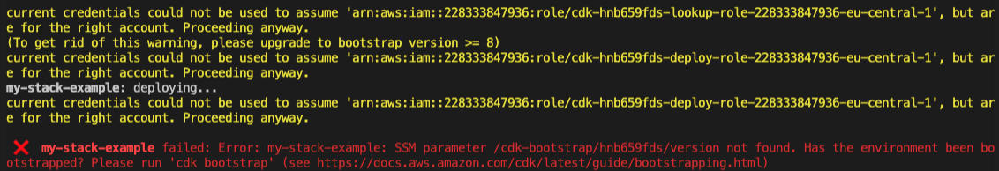
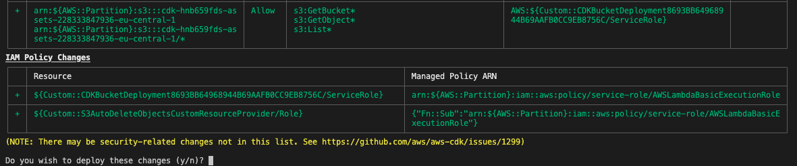

# Static Hosting in AWS

## In this lab …

- Learn how to set up AWS CDK
- Learn how to deploy your app (or single page applications) with AWS

## Bootstrapping

### 📝 Task

Create a fresh AWS CDK app with Projen.

### 🔎 Hints

- [Getting started with Projen](https://github.com/projen/projen#getting-started)

### 🗺 Step-by-Step Guide

1. Create a new folder `notes-api`:
   ```bash
   mkdir notes-api
   ```
1. Step into the folder:
   ```bash
   cd notes-api
   ```
1. Init AWS CDK with Projen:
   ```bash
   npx projen@latest new awscdk-app-ts --package-manager 'NPM' --github false --no-git
   ```
1. Install Node.js dependencies:
   ```bash
   npm i
   ```
1. Rename the `.projenrc.ts` file to `.projenrc.js:`
   ```bash
   mv .projenrc.ts .projenrc.js
   ```
1. Go to the file `./src/main.ts`. Scroll down and find this line:

```ts
new MyStack(app, "notes-api-dev", { env: devEnv });
```

Rename `notes-api-dev` to something unique (e.g. append your name).

1. Deploy your CDK Stack:

   ````bash

   ```bash
   npm run deploy
   ````

   ⚠️You might run into the following error:

   

   If this is the case, you need to bootstrap your environment first by running:

   ```bash
   cdk bootstrap
   ```

   Afterwards you can go ahead and deploy the CDK stack again. This time it should work.

## Frontend Application

### 📝 Task

Create a frontend app in a new subfolder we can deploy as a static website.

### 🔎 Hints

- [Creating a TypeScript app with Create React App](https://create-react-app.dev/docs/getting-started/#creating-a-typescript-app)

### 🗺 Step-by-Step Guide

1. Clone the example app into the root project:

```bash
git clone GITHUBXXXXX/frontend ~/notes-api/frontend
```

1. Navigate to the frontend folder: `cd frontend`
1. Rename the `.env.example` file inside the frontend folder and turn it into a `.env` file.
1. Run `npm i` inside the frontend folder to install the dependencies.

We aren't going to start the frontend server right now, but we'll get to see our app soon enough.

## CDK Stack

### 📝 Task

Now that we have created a frontend app, we want to add the infrastructure to deploy it.

It is hence time to create our first resources using CDK for the static hosting. The CDK stack should include a S3 bucket for the assets, a CloudFront distributon and deployment steps to bundle the frontend assets.

### 🔎 Hints

- [Documentation AWS CDK Stacks](https://docs.aws.amazon.com/cdk/latest/guide/stacks.html)
- [AWS Construct to deploy a S3 bucket with CloudFront distribution and cache invalidation](https://docs.aws.amazon.com/cdk/api/v2/docs/aws-cdk-lib.aws_s3_deployment-readme.html#cloudfront-invalidation)
- [Documentation Invalidating Files in CloudFront (watch out for solutions to invalidate all files)](https://docs.aws.amazon.com/AmazonCloudFront/latest/DeveloperGuide/Invalidation.html)
- [Bundle JS assets locally with AWS CDK S3 Deployment (scroll down to the last section)](https://aws.amazon.com/blogs/devops/building-apps-with-aws-cdk/)

### 🗺 Step-by-Step Guide

1. In the root project, extend the list of CDK dependencies in the `.projenrc.js` configuration. The final file should look like this:

   ```js
   const { awscdk, javascript } = require("projen");
   const project = new awscdk.AwsCdkTypeScriptApp({
     cdkVersion: "2.1.0",
     defaultReleaseBranch: "main",
     github: false,
     name: "notes-api",
     packageManager: javascript.NodePackageManager.NPM,
     deps: ["aws-sdk", "fs-extra"],
     devDeps: ["@types/fs-extra"],
   });

   project.synth();
   ```

1. If you are in the frontend folder, cd back to the root project to install the new dependencies and re-generate the auto-generated files:

   ```bash
   cd ..
   npm run projen
   ```

1. Create a new file for our first construct:
   ```bash
   touch ./src/static-hosting.ts
   ```
1. Open the file and paste the following code:

   ```typescript
   import { execSync } from "child_process";
   import * as path from "path";
   import { CfnOutput, DockerImage, RemovalPolicy } from "aws-cdk-lib";
   import * as cloudfront from "aws-cdk-lib/aws-cloudfront";
   import * as origins from "aws-cdk-lib/aws-cloudfront-origins";
   import * as s3 from "aws-cdk-lib/aws-s3";
   import * as s3deploy from "aws-cdk-lib/aws-s3-deployment";
   import { Construct } from "constructs";
   import * as fs from "fs-extra";

   export class StaticHosting extends Construct {
     constructor(scope: Construct, id: string) {
       super(scope, id);

       const bucket = new s3.Bucket(this, "frontend", {
         removalPolicy: RemovalPolicy.DESTROY,
         autoDeleteObjects: true,
       });

       const distribution = new cloudfront.Distribution(
         this,
         "frontend-distribution",
         {
           defaultBehavior: { origin: new origins.S3Origin(bucket) },
           defaultRootObject: "index.html",
         }
       );

       new s3deploy.BucketDeployment(this, "frontend-deployment", {
         sources: [
           s3deploy.Source.asset(path.join(__dirname, "../frontend"), {
             bundling: {
               local: {
                 tryBundle(outputDir) {
                   try {
                     execSync("npm --version");
                   } catch {
                     return false;
                   }

                   execSync(`
                       npm --prefix ./frontend i &&
                       npm --prefix ./frontend run build
                     `);

                   fs.copySync(
                     path.join(__dirname, "../frontend", "build"),
                     outputDir
                   );

                   return true;
                 },
               },
               image: DockerImage.fromRegistry("node:lts"),
               command: [],
             },
           }),
         ],
         destinationBucket: bucket,
         distribution,
         distributionPaths: ["/*"],
       });

       new CfnOutput(this, "FrontendURL", {
         value: `https://${distribution.distributionDomainName}`,
       });
     }
   }
   ```

1. Update the main stack in the `./src/main.ts` file:

   ```typescript
   import { App, Stack, StackProps } from "aws-cdk-lib";
   import { Construct } from "constructs";
   import { StaticHosting } from "./static-hosting";

   export class MyStack extends Stack {
     constructor(scope: Construct, id: string, props: StackProps = {}) {
       super(scope, id, props);

       new StaticHosting(this, "static-hosting");
     }
   }
   ```

````
⚠️Important: Only update the imports and the class. Everything below the class should be the same.
1. Deploy the latest changes:
 ```bash
 npm run deploy
````

You will be asked if you want to make security-related changes. Confirm with `y`.



1. Your stack should have output an url in the console: follow it to visit the site.

⚠️Important: You should keep this URL so you can check the progress in the upcoming labs.

---

%TODO: Update following implementation + link:
You can find the complete implementation of this lab [here](https://github.com/superluminar-io/fullstack-serverless-workshop/tree/main/packages/lab2).
