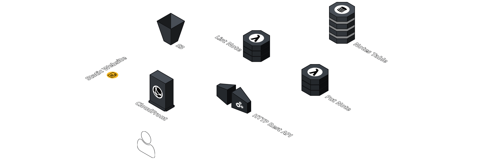

# Frontend to Fullstack: A Serverless Workshop

## Welcome

This workshop is designed to help you expand your skillset beyond frontend know-how to fullstack serverless development with AWS. Together we will create the next greatest note-taking app. First we will create the resources necessary to host our frontend on S3. Then we will create a serverless backend with API Gateway, Lambda and DynamoDB and connect our frontend to our backend to create a fully functional app. Along the way we try to identify best practices and antipatterns.

Let's get started! 🤩

## Architecture Diagram

The API enables us to create the next awesome notes app. With two routes in place, we can create a new note and list all notes. For both routes, we call Lambda functions and persist our data in a DynamoDB table.

## Prerequisites

- AWS account with admin permissions
- All step-by-step guides are written in English, we recommend selecting _English (US)_ as the language for the AWS console. You find the option in the footer of the console.

## Scope

- Infrastructure as Code with AWS CDK
- Static Hosting with S3 and CloudFront
- Simple RESTful HTTP API with Amazon API Gateway
- Serverless computation with Lambda
- NoSql Database with DynamoDB

## Out of Scope

- Authentication / Authorization
- Custom Domain with SSL Cert
- Deep dive Testing, Monitoring, Logging and Tracing
